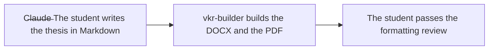
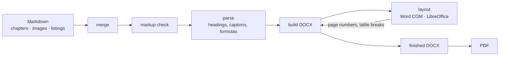

| en :gb: | ru :ru: |
| ---- | ---- |
| README.en.md | [README.md](README.md) |

# vkr-builder

> TL;DR: *You write the text, the build does GOST*


[](https://github.com/maxbarsukov/vkr-builder/actions/workflows/tests.yml)

## 👷 What is vkr-builder?

**vkr-builder** is a tool that builds a graduation thesis from Markdown files, formatted to the requirements of GOST.



Formatting follows the ITMO standard [**ЛНАОБУЧ-СМК-03-05-2022**](https://student.itmo.ru/files/1314) and **GOST 7.32-2017**.

---

## 📖 About <a name="about"></a>
### ✨ Features <a name="features"></a>

- **You write the text, the tool does the formatting.** \
  Font, spacing, margins, heading styles, captions and lists — all (almost) to GOST.
  The settings can be changed in the config.
- **You do not have to track numbers and references.** \
  Figures, listings, formulas and sources are numbered at build time.
  In the text you refer to a key — in the document it comes out as a number you
  can click. The table of contents is assembled the same way.
- **A listing matches the code, a formula stays editable.** \
  The listing is pulled from the real file: change the code and the next build
  takes the new version. A formula is inserted as a Word formula — you can open
  and edit it.
- **Markup mistakes surface before the build.** \
  `lint` checks the text and names the file and the line where something is
  wrong, before it reaches the document.
- **What comes out is what you hand in.** \
  DOCX and PDF, with document properties from the config.
  There can be several theses, each with its own settings.

### 📚 Documentation <a name="documentation"></a>

| Document | Description |
|----------|-------------|
| [example/](example/README.en.md) | Demo thesis |
| [config.defaults.yaml](config.defaults.yaml) | System defaults |
| [config.yaml](config.yaml) | User settings |
| [docs/llm-format/](docs/llm-format/README.en.md) | Markdown authoring rules (what you hand to your LLM) |
| [docs/cli/](docs/cli/README.en.md) | Commands, flags, environment variables, config|
| [docs/rules/](docs/rules/README.en.md) | Catalogue of check rules |
| [docs/limitations/](docs/limitations/README.en.md) | Known limitations |

## 🚀 Getting started <a name="getting-started"></a>
### 💻 Requirements and platforms <a name="requirements-and-platforms"></a>

| Component | Windows | Linux / macOS |
|-----------|---------|---------------|
| Python 3.10+ | yes | yes |
| DOCX build (`python-docx`) | yes | yes |
| Layout / PDF through **Word** | yes (Word + `pywin32`) | no |
| Layout / PDF through **LibreOffice** | yes | yes |

- Python 3.10+, `python-docx`, `PyYAML` — see [requirements.txt](requirements.txt).
- Layout and PDF engine:
  - **Microsoft Word** + `pywin32` (Windows only), or
  - **LibreOffice** (Windows, Linux, macOS) headless. On Debian and Ubuntu the
    UNO bridge is a separate package, `python3-uno`.

#### Installation

```bash
git clone https://github.com/maxbarsukov/vkr-builder.git
cd vkr-builder

python -m venv .venv
# Windows:  .venv\Scripts\activate
# Linux/macOS:  source .venv/bin/activate

pip install -r requirements.txt
```

Checking the environment:

```bash
./vkr-builder.sh doctor          # Linux/macOS
vkr-builder.bat doctor           # Windows
```

#### Docker

Build without installing Python and LibreOffice on the host:

```bash
docker build -t vkr-builder .
docker run --rm -v "$PWD/example:/work/example" vkr-builder build --pdf
```

### ⚡ Quick start <a name="quick-start"></a>

From the repository root:

```bash
./vkr-builder.sh build --pdf       # Linux/macOS
vkr-builder.bat build --pdf        # Windows
```

This produces `example/VKR-example.docx` and `example/VKR-example.pdf`.

The wrappers find Python 3.10+ themselves (`python3`, `python` or `py -3`).
Without them it is the same: `python main.py build`.

### 📝 Starting your own thesis <a name="starting-your-own-thesis"></a>

1. **Create a config.** Copy `config.yaml` or generate a template:

   ```bash
   vkr-builder.bat init
   ```

   It says where the thesis lives and where the result is built. What each key
   means: [«Configuration»](docs/cli/README.en.md#configuration).

2. **Lay out the chapters.** Every chapter is a separate Markdown file. Point
   `markdown_dir` at the directory holding them and list the files in
   `markdown_files`, in the order they appear in the document. The rules for
   writing the text: [docs/llm-format/](docs/llm-format/README.en.md).

3. **Check the config and the files:**

   ```bash
   vkr-builder.bat validate
   vkr-builder.bat lint
   vkr-builder.bat stats
   ```

4. **Build the DOCX:**

   ```bash
   ./vkr-builder.sh build          # Linux/macOS
   vkr-builder.bat build           # Windows
   ```

## ✍️ Writing the thesis <a name="writing-the-thesis"></a>
### ✒️ Markdown <a name="markdown"></a>

Ordinary Markdown plus a few conventions:

```markdown
# 1 Анализ предметной области


Рисунок {pipeline} - Схема обработки

Порядок разбора показан на рисунке [рис:pipeline], требования — в
таблице [табл:req]. Подход описан в [{gost732}].
```

Tables, listings and formulas work the same way: a caption with a key, a
reference by key. The numbers are assigned at build time.

The full specification, with every prefix, both citation styles and the
structural rules: **[docs/llm-format/](docs/llm-format/README.en.md)**.

An existing DOCX can be turned into a PDF separately:

```bash
./vkr-builder.sh pdf example/VKR-example.docx
```

### 🔍 Lint <a name="lint"></a>

```bash
./vkr-builder.sh lint
```

Errors stop the build, warnings do not; `lint.strict: true` makes the second
into the first.

If you think a warning is wrong, it can be silenced from the Markdown itself:

```markdown
<!-- @suppress unknown-reference -->
```

The directive applies to the next element, `<!-- @suppress-file -->` to the rest
of the file. Every rule name is listed in [docs/rules/](docs/rules/README.en.md).

### 🤖 Working with AI assistants <a name="working-with-ai-assistants"></a>

The [docs/llm-format/](docs/llm-format/README.en.md) specification is written
for exactly that — hand the whole file to the model before asking it to write a
chapter.

For Claude Code and Cursor the rules already ship with the repository and load
automatically — `.claude/skills/` and `.cursor/rules/`. They cover writing the
text, running the build, reading warnings and working on the tool itself.

### 🩺 Troubleshooting <a name="troubleshooting"></a>

| Symptom | What to check |
|---------|---------------|
| `Python 3.10+ not found` | Install Python and add it to PATH, or use `py -3` (Windows) |
| Word COM / `pywin32` error | Windows only; install Word and `pip install pywin32` |
| `LibreOffice not found` | Set the path: `build.libreoffice_path` in the config |
| `no Python with the UNO bridge` | The bridge ships apart from the suite: `sudo apt install python3-uno` |
| Broken cross-references | Run `lint`; check the keys against [docs/llm-format/](docs/llm-format/README.en.md) |

## 📘 Reference <a name="reference"></a>

```bash
./vkr-builder.sh doctor      # what was found on this machine
./vkr-builder.sh lint        # check the markup
./vkr-builder.sh build --pdf # build the DOCX and the PDF
```

The full reference — commands, flags, environment variables, exit codes, the
report format and the config: **[docs/cli/](docs/cli/README.en.md)**.

## 🔧 Development and adaptation <a name="development-and-adaptation"></a>

### 🗂️ Project layout <a name="project-layout"></a>

```text
vkr-builder.sh / vkr-builder.bat   Wrappers to run it (preferred)
main.py              CLI entry point
config.yaml          User config
config.defaults.yaml System defaults
src/
  vkr/               Library code (cli, config, docx/, md, ...)
  tests/             pytest
example/             Demo thesis
  README.md            Description of the example
  md/                  Markdown chapters
  images/              Images
  listings/            Files pulled in by @listing
  VKR-example.docx     Build result
docs/                llm-format, cli, rules, limitations
.github/             CI, PR/issue templates, Dependabot, CONTRIBUTING
.claude/ .cursor/    Rules for AI assistants
```

### ⚙️ How it works <a name="how-it-works"></a>



Layout and build go round in a circle: while the page numbers and the table
break points keep changing from pass to pass, the document is built again.

### 🎓 Adapting to your requirements <a name="adapting-to-your-requirements"></a>

The tool formats the document to ITMO's requirements. Another university's may
differ, and most of the difference can be levelled out with the [config](docs/cli/README.en.md#configuration).

| What to change | Key |
|----------------|-----|
| font, size, spacing, margins, first numbered page | `style.text`, `style.page` |
| figure width, splitting of long tables | `style.figures`, `style.tables` |
| strictness of the checks, size thresholds | `lint.strict`, `stats.*` |

Deeper changes are made in the code:

| What to change | File |
|----------------|------|
| names of the structural sections | `src/vkr/gost_sections.py`, `STRUCTURAL_HEADINGS` |
| a markup check of your own | `src/vkr/md_lint.py`, the rule name in `src/vkr/suppress.py` |
| the format of captions and headings | `src/vkr/docx/headings.py`, `src/vkr/docx/elements.py` |

Look for a config key first and only then edit the code.

### 🧪 Tests <a name="tests"></a>

```bash
pip install -r requirements-dev.txt
python -m pytest src/tests
```

## 👥 Community and support <a name="community-and-support"></a>

### 🤝 Contributing <a name="contributing"></a>

Hey! We're glad you're thinking about contributing to **vkr-builder**!
Feel free to pick an issue labelled `good first issue` and ask whatever you need — some things are bound to be unclear, and
we'll guide you through.

Bug reports and pull requests are welcome on GitHub at <https://github.com/maxbarsukov/vkr-builder>.

Before opening a PR, please read [CONTRIBUTING.md](.github/CONTRIBUTING.md). It describes how to shape a change, which checks run in CI and what a PR needs to be accepted.

### ⚖️ Code of Conduct <a name="code-of-conduct"></a>

This project is intended to be a safe, welcoming space for collaboration.
Everyone interacting with the **vkr-builder** codebases, issue trackers, chat rooms and mailing lists is expected to adhere to the [code of conduct](.github/CODE_OF_CONDUCT.md).

### 📫 Get in touch <a name="get-in-touch"></a>

Want to make a suggestion or leave feedback? Here are some channels you can reach us through:

- 🐛 Found a bug? [Open an issue](https://github.com/maxbarsukov/vkr-builder/issues) in the repository!
- 💬 Want to discuss formatting, ask a question or suggest an improvement? Start a thread in [Discussions](https://github.com/maxbarsukov/vkr-builder/discussions).

### 🛡️ Security <a name="security"></a>

**vkr-builder** takes software security seriously. If you believe you have found a security vulnerability in this repository,
please report it privately according to our [security policy](.github/SECURITY.md) — do not open a public issue.

### 📖 Citing <a name="citing"></a>

If you use this tool in academic work, please cite it via the metadata in [`CITATION.cff`](CITATION.cff). A short form:

```bibtex
@software{vkr_builder,
  author  = {Barsukov, Max and HiterretiH},
  title   = {vkr-builder: Markdown to GOST-formatted DOCX thesis builder},
  year    = {2026},
  url     = {https://github.com/maxbarsukov/vkr-builder},
  version = {0.1.0}
}
```

## 🪪 License <a name="license"></a>

The project is available as open source under the terms of the [MIT License](https://opensource.org/licenses/MIT). \
*Copyright 2026 Max Barsukov & HiterretiH*

**Leave a star :star: if you find this project useful — it helps a lot.**

---

*<p align="center">This project is published under [MIT](LICENSE).<br>A [maxbarsukov](https://github.com/maxbarsukov) & [HiterretiH](https://github.com/HiterretiH) project.<br>- :tada: -</p>*
