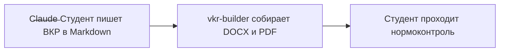
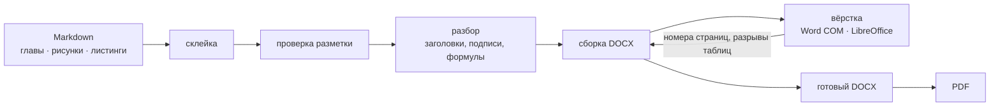

| en :gb: | ru :ru: |
| ---- | ---- |
| [README.en.md](README.en.md) | README.md |

# vkr-builder

> TL;DR: *Пишете ВКР в Markdown — получаете DOCX по ГОСТ*


[](https://github.com/maxbarsukov/vkr-builder/actions/workflows/tests.yml)

## 👷 Что такое vkr-builder?

**vkr-builder** — это утилита для автоматической сборки выпускной квалификационной работы по требованиям ГОСТ из Markdown-файлов.



Оформление следует стандарту ИТМО [**ЛНАОБУЧ-СМК-03-05-2022**](https://student.itmo.ru/files/1314) и **ГОСТ 7.32-2017**.

---

## 📖 О проекте <a name="о-проекте"></a>
### ✨ Возможности <a name="возможности"></a>

- **Вы пишете текст, оформление берёт на себя инструмент.** \
  Шрифт, интервалы, поля, стили заголовков, подписи и списки — всё (почти) по ГОСТ.
  Настройки можно изменить в конфигурации.
- **Номера и ссылки не нужно держать в голове.** \
  Рисункам, листингам, формулам и источникам номера присваиваются при сборке.
  В тексте вы ссылаетесь на ключ — в документе оказывается номер, по которому можно
  кликнуть. Формирование оглавления также происходит автоматически.
- **Листинг совпадает с кодом, формула остаётся редактируемой.** \
  Листинг подтягивается из настоящего файла: изменили код — следующая сборка возьмёт
  новую версию. Формула вставляется как формула Word, её можно открыть и
  изменить.
- **Ошибки разметки видно до сборки.** \
  `lint` проверяет текст и называет файл и строку, где что-то не так, — раньше,
  чем это попадёт в документ.
- **На выходе — то, что можно сдавать.** \
  DOCX и PDF, со свойствами документа из конфига.
  Работ может быть несколько, каждая со своими настройками.

### 📚 Документация <a name="документация"></a>

| Документ | Описание |
|----------|----------|
| [example/](example/) | Демо-пример ВКР |
| [config.defaults.yaml](config.defaults.yaml) | Системные настройки по умолчанию |
| [config.yaml](config.yaml) | Пользовательские настройки |
| [docs/llm-format/](docs/llm-format/) | Правила разметки Markdown (то, что вы отправите своей LLM) |
| [docs/cli/](docs/cli/) | Команды, флаги, переменные окружения, конфигурация |
| [docs/rules/](docs/rules/) | Каталог правил проверок |
| [docs/limitations/](docs/limitations/) | Известные ограничения |

## 🚀 Начало работы <a name="начало-работы"></a>
### 💻 Требования и платформы <a name="требования-и-платформы"></a>

| Компонент | Windows | Linux / macOS |
|-----------|---------|---------------|
| Python 3.10+ | да | да |
| Сборка DOCX (`python-docx`) | да | да |
| Вёрстка / PDF через **Word** | да (Word + `pywin32`) | нет |
| Вёрстка / PDF через **LibreOffice** | да | да |

- Python 3.10+, `python-docx`, `PyYAML` — см. [requirements.txt](requirements.txt).
- Движок вёрстки и PDF:
  - **Microsoft Word** + `pywin32` (только Windows), или
  - **LibreOffice** (Windows, Linux, macOS) в headless-режиме. На Debian и
    Ubuntu отдельными пакетами идут мост UNO и модуль формул: `python3-uno` и `libreoffice-math`.

#### Установка

```bash
git clone https://github.com/maxbarsukov/vkr-builder.git
cd vkr-builder

python -m venv .venv
# Windows:  .venv\Scripts\activate
# Linux/macOS:  source .venv/bin/activate

pip install -r requirements.txt
```

Проверка окружения:

```bash
./vkr-builder.sh doctor          # Linux/macOS
vkr-builder.bat doctor           # Windows
```

#### Docker

Собрать без установки Python и LibreOffice на хост:

```bash
docker build -t vkr-builder .
docker run --rm -v "$PWD/example:/work/example" vkr-builder build --pdf
```

### ⚡ Быстрый старт <a name="быстрый-старт"></a>

Из корня репозитория:

```bash
./vkr-builder.sh build --pdf       # Linux/macOS
vkr-builder.bat build --pdf        # Windows
```

Будут сгенерированы `example/VKR-example.docx` и `example/VKR-example.pdf`.

Обёртки сами находят Python 3.10+ (`python3`, `python` или `py -3`). Без них
то же самое: `python main.py build`.

### 📝 Как начать свою ВКР <a name="как-начать-свою-вкр"></a>

1. **Создать конфиг.** Скопируйте `config.yaml` или сгенерируйте шаблон:

   ```bash
   vkr-builder.bat init
   ```

   В нём задаётся, где лежит работа и куда собирается результат. Что означает
   каждый ключ — [«Конфигурация»](docs/cli/README.md#конфигурация).

2. **Разложить главы.** Каждая глава — отдельный файл Markdown. Каталог с ними
   укажите в `markdown_dir`, сами файлы перечислите в `markdown_files` —
   в том порядке, в каком они пойдут в документе. По каким правилам писать
   текст: [docs/llm-format/](docs/llm-format/).

3. **Проверить конфиг и файлы:**

   ```bash
   vkr-builder.bat validate
   vkr-builder.bat lint
   vkr-builder.bat stats
   ```

4. **Собрать DOCX:**

   ```bash
   ./vkr-builder.sh build          # Linux/macOS
   vkr-builder.bat build           # Windows
   ```

## ✍️ Написание работы <a name="написание-работы"></a>
### ✒️ Разметка Markdown <a name="разметка-markdown"></a>

Обычный Markdown плюс несколько соглашений:

```markdown
# 1 Анализ предметной области


Рисунок {pipeline} - Схема обработки

Порядок разбора показан на рисунке [рис:pipeline], требования — в
таблице [табл:req]. Подход описан в [{gost732}].
```

Так же устроены таблицы, листинги и формулы: подпись с ключом, ссылка по
ключу. Номера проставляются при сборке.

Полная спецификация со всеми префиксами, стилями цитирования и правилами
структуры: **[docs/llm-format/](docs/llm-format/)**.

Готовый DOCX можно превратить в PDF отдельно:

```bash
./vkr-builder.sh pdf example/VKR-example.docx
```

### 🔍 Lint <a name="lint"></a>

```bash
./vkr-builder.sh lint
```

Ошибки останавливают сборку, предупреждения — нет; `lint.strict: true`
приравнивает вторые к первым.

Если вы считаете предупреждение неактуальным, его можно отключить прямо в Markdown:

```markdown
<!-- @suppress unknown-reference -->
```

Пометка действует на следующий элемент, `<!-- @suppress-file -->` — до конца
файла. Имена правил перечислены в [docs/rules/](docs/rules/).

### 🤖 Работа с ИИ-ассистентами <a name="работа-с-ии-ассистентами"></a>

Спецификация [docs/llm-format/](docs/llm-format/) написана как раз для
этого — её можно целиком отдать модели перед тем, как просить сгенерировать главу.

Для Claude Code и Cursor правила уже лежат в репозитории и подхватываются
сами — `.claude/skills/` и `.cursor/rules/`. Они покрывают написание текста,
сборку, разбор предупреждений и правку самого инструмента.

### 🩺 Устранение неполадок <a name="устранение-неполадок"></a>

| Симптом | Что проверить |
|---------|---------------|
| `Python 3.10+ not found` | Установите Python и добавьте в PATH, или используйте `py -3` (Windows) |
| Ошибка Word COM / `pywin32` | Только Windows; установите Word и `pip install pywin32` |
| `LibreOffice not found` | Укажите путь: `build.libreoffice_path` в конфиге |
| `no Python with the UNO bridge` | Мост идёт отдельно от пакета: `sudo apt install python3-uno` |
| Битые перекрёстные ссылки | Запустите `lint`; сверьте ключи с [docs/llm-format/](docs/llm-format/) |

## 📘 Справочник <a name="справочник"></a>

```bash
./vkr-builder.sh doctor      # что нашлось в системе
./vkr-builder.sh lint        # проверить разметку
./vkr-builder.sh build --pdf # собрать DOCX и PDF
```

Полный справочник — команды, флаги, переменные окружения, коды возврата, формат
отчёта и конфигурация: **[docs/cli/](docs/cli/)**.

## 🔧 Разработка и адаптация <a name="разработка-и-адаптация"></a>

### 🗂️ Структура проекта <a name="структура-проекта"></a>

```text
vkr-builder.sh / vkr-builder.bat   Обёртки для запуска (рекомендуется)
main.py              Точка входа CLI
config.yaml          Пользовательский конфиг
config.defaults.yaml Системные значения по умолчанию
src/
  vkr/               Код библиотеки (cli, config, docx/, md, ...)
  tests/             pytest
example/             Демо-ВКР
  README.md            Описание примера
  md/                  Главы Markdown
  images/              Изображения
  listings/            Файлы для @listing
  VKR-example.docx     Результат сборки
docs/                llm-format, cli, rules, limitations
.github/             CI, шаблоны PR/issue, Dependabot, CONTRIBUTING
.claude/ .cursor/    Правила для ИИ-ассистентов
```

### ⚙️ Как это устроено <a name="как-это-устроено"></a>



Вёрстка и сборка ходят по кругу: пока номера страниц и точки разрыва таблиц
меняются от прохода к проходу, документ пересобирается заново.

### 🎓 Адаптация под требования <a name="адаптация-под-требования"></a>

Инструмент оформляет документ по требованиям ИТМО. Требования другого вуза
могут отличаться, и большую часть отличий можно нивелировать [конфигурацией](docs/cli/README.md#конфигурация).

| Что менять | Ключ |
|------------|------|
| шрифт, кегль, интервал, поля, первая нумеруемая страница | `style.text`, `style.page` |
| ширина рисунков, перенос длинных таблиц | `style.figures`, `style.tables` |
| строгость проверок, пороги объёма | `lint.strict`, `stats.*` |

Более радикальные изменения правятся в коде:

| Что менять | Файл |
|------------|------|
| названия структурных разделов | `src/vkr/gost_sections.py`, `STRUCTURAL_HEADINGS` |
| своя проверка разметки | `src/vkr/md_lint.py`, имя правила в `src/vkr/suppress.py` |
| формат подписей и заголовков | `src/vkr/docx/headings.py`, `src/vkr/docx/elements.py` |

Сначала ищите ключ в конфиге и только потом правьте код.

### 🧪 Тестирование <a name="тестирование"></a>

```bash
pip install -r requirements-dev.txt
python -m pytest src/tests
```

## 👥 Сообщество и поддержка <a name="сообщество-и-поддержка"></a>

### 🤝 Содействие <a name="содействие"></a>

Привет! Мы рады, что вы думаете о том, чтобы внести свой вклад в **vkr-builder**!
Не стесняйтесь выбирать проблему с пометкой `good first issue` и задавать любые вопросы, которые вам интересны. Некоторые моменты могут быть неясны, и мы готовы вам помочь!

Отчеты об ошибках и запросы на включение приветствуются на GitHub по адресу <https://github.com/maxbarsukov/vkr-builder>.

Прежде чем создавать свой PR, мы настоятельно рекомендуем вам заглянуть в [CONTRIBUTING.md](.github/CONTRIBUTING.md). В нём описано, как оформлять изменения, какие проверки проходят в CI и что нужно для успешного принятия PR.

### ⚖️ Нормы поведения <a name="нормы-поведения"></a>

Этот проект призван стать безопасным и гостеприимным пространством для совместной работы, и ожидается, что все, кто взаимодействует с кодовыми базами проекта **vkr-builder**, системами отслеживания проблем, чатами и списками рассылки, будут соблюдать [кодекс поведения](.github/CODE_OF_CONDUCT.md).

### 📫 Связаться <a name="связаться"></a>

Хотите внести предложение или оставить отзыв? Вот некоторые каналы, по которым вы можете связаться с нами:

- 🐛 Нашли ошибку? [Откройте задачу](https://github.com/maxbarsukov/vkr-builder/issues) в репозитории!
- 💬 Хотите обсудить оформление, задать вопрос или предложить улучшение? Заведите обсуждение в [Discussions](https://github.com/maxbarsukov/vkr-builder/discussions).

### 🛡️ Безопасность <a name="безопасность"></a>

**vkr-builder** серьёзно относится к безопасности программного обеспечения. Если вы считаете, что обнаружили уязвимость, пожалуйста, сообщите о ней приватно, как описано в [политике безопасности](.github/SECURITY.md), — не открывайте публичную задачу.

### 📖 Цитирование <a name="цитирование"></a>

Если вы используете этот инструмент в академической работе, пожалуйста, сошлитесь на него по
метаданным из [CITATION.cff](CITATION.cff). В кратком виде:

```bibtex
@software{vkr_builder,
  author  = {Barsukov, Max and HiterretiH},
  title   = {vkr-builder: Markdown to GOST-formatted DOCX thesis builder},
  year    = {2026},
  url     = {https://github.com/maxbarsukov/vkr-builder},
  version = {0.1.0}
}
```

## 🪪 Лицензия <a name="лицензия"></a>

Проект доступен с открытым исходным кодом на условиях [Лицензии MIT](https://opensource.org/licenses/MIT). \
*Авторские права 2026 Max Barsukov & HiterretiH*

**Поставьте звезду :star:, если проект оказался полезен.**

---

*<p align="center">Проект опубликован под лицензией [MIT](LICENSE).<br>Сделано [maxbarsukov](https://github.com/maxbarsukov) & [HiterretiH](https://github.com/HiterretiH).<br>- :tada: -</p>*
